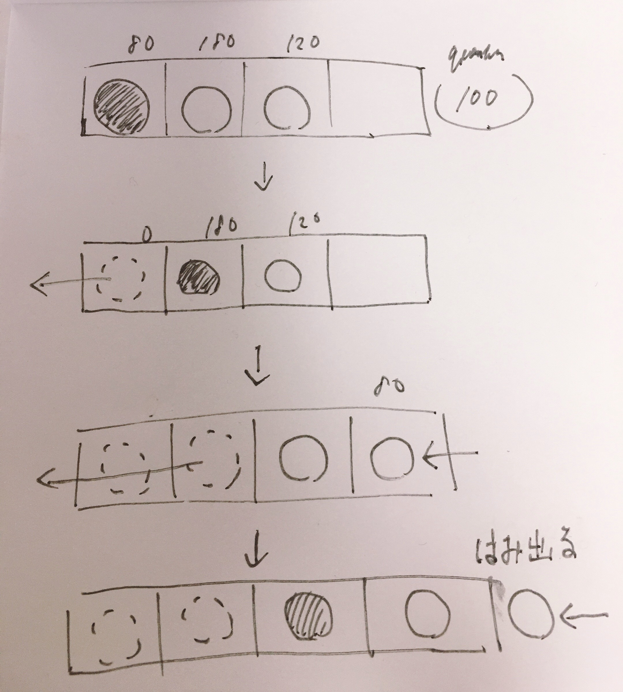

# データ構造
<!-- TOC -->

- [Queue](#queue)
    - [概要](#概要)
- [Stack](#stack)
    - [概要](#概要-1)
    - [Stackの実装に必要な主な変数](#stackの実装に必要な主な変数)
    - [Stackの実装に必要な主な関数](#stackの実装に必要な主な関数)
- [Linked List](#linked-list)
    - [概要](#概要-2)
    - [計算量](#計算量)

<!-- /TOC -->

## Queue

### 概要

ラウンドロビンスケジュールを実装するためにキューを用いる  
初期状態のプロセスをキューに入れ、キューが空になるまで「先頭からキューを取り出し、最大でもクオンタムだけ処理を行い、まだ必要な時間が残っている場合には再度キューに追加する」を繰り返す  
配列によってキューを実装すると、データの追加と取り出しを繰り返すとはみ出てしまう
かといってheadが0を保つように、毎回各要素を左に1つ詰め直したら、毎回`O(n)`の計算が必要になってしまう

  

この問題を解決するために、配列によるキューの実装では次のように配列をリングバッファとみなしてデータを管理することがある

## Stack

### 概要

スタックやその他のデータ構造の実装には配列やリスト（ポインタ）を使ったものなど、いくつかの方法があります。
goとrustにおいて配列はビルド時に決定してしまうもののため、Goではスライス、RustではVecを利用します。

### Stackの実装に必要な主な変数

- データを格納するための配列: `s`
- スタックポインタを表す変数: `top`
  - スタックの頂点の要素（最後に追加された要素）を指し示す整数型の変数
  - topの値はスタックの要素数に等しくなる（インデックスが0は空にしておくため）

### Stackの実装に必要な主な関数

- スタックに要素を追加する: `push(x)`
  - topの数を1増やし、`s[top]`に代入する
- スタックから要素を取り出す: `pop()`
  - `s[top]`の値を返し、`top`を一つ減らす

## Linked List

### 概要

リストの途中に要素を高速に追加/削除できる一方で、インデックスを指定して要素を代入/取得する処理に時間がかかる。リストの途中に要素を追加すると、それ以降の要素も1つずつ後ろにずらす必要のある配列（Javaでいう`ArrayList`の実装）と逆の特徴を持っていると言える。  
なぜインデックスを指定しての操作に時間がかかるかというと、先頭から順番にたどる必要があるためだ。`LinkedList`をループで回すときにはindexを利用したfor文でなく、iteratorやfor-eachなどを利用するべき。  

双方向連結リストはデータ本体に加えて、自身の前要素と次要素のポインタを持つ。各要素を`ノード`と呼称する。  
リストの先頭を指す特別なノードを設置することで実装を簡略化することができる。このノードは番兵と呼ばれる。実データに含めないものの、ポインタの繋ぎ変えを容易にできる。

### 計算量

要素の追加はポインタをつなぎ替えるだけなので`O(1)`  
N個の要素を含むリストに対する検索は`O(N)`