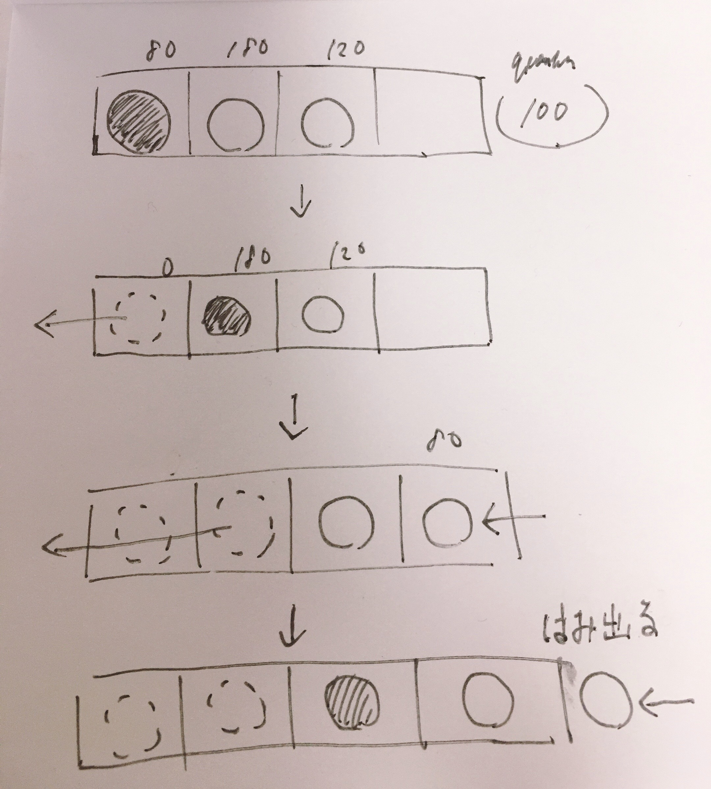

# Queue

## description

ラウンドロビンスケジュールを実装するためにキューを用いる  
初期状態のプロセスをキューに入れ、キューが空になるまで「先頭からキューを取り出し、最大でもクオンタムだけ処理を行い、まだ必要な時間が残っている場合には再度キューに追加する」を繰り返す  
配列によってキューを実装すると、データの追加と取り出しを繰り返すとはみ出てしまう
かといってheadが0を保つように、毎回各要素を左に1つ詰め直したら、毎回`O(n)`の計算が必要になってしまう

  

この問題を解決するために、配列によるキューの実装では次のように配列をリングバッファとみなしてデータを管理することがある

### Stackの実装に必要な主な変数

### Stackの実装に必要な主な関数