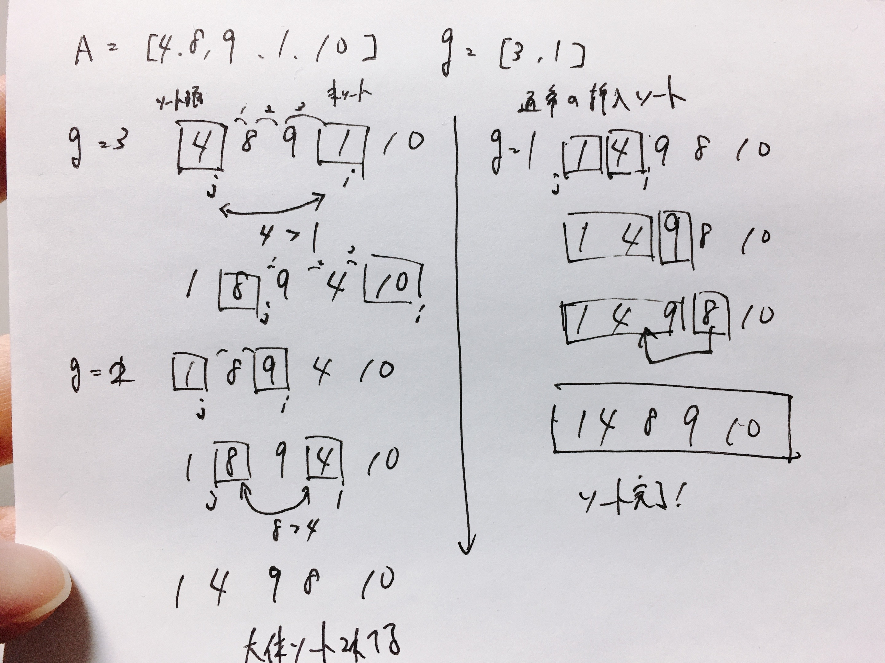

# 初等的整列

<!-- TOC -->

- [Stable Sortについて](#stable-sortについて)
    - [例](#例)
        - [もともとの表](#もともとの表)
        - [Stable Sort](#stable-sort)
        - [Unstable Sort](#unstable-sort)
- [挿入ソート](#挿入ソート)
    - [概要](#概要)
    - [図示](#図示)
    - [計算量](#計算量)
- [バブルソート](#バブルソート)
    - [概要](#概要-1)
    - [計算量](#計算量-1)
- [選択ソート](#選択ソート)
    - [概要](#概要-2)
    - [計算量](#計算量-2)
- [シェルソート](#シェルソート)
    - [概要](#概要-3)

<!-- /TOC -->

## Stable Sortについて

キーの値が同じ要素を2つ以上含むデータをソートした場合に、処理の前後でそれらの要素の順番が変わらないようなアルゴリズムをstable sortという。

### 例

表のソートで例示する。  
入力では、player1 -> player2 -> player3 の順に並んでいる。  
これを英語の点数でソートする。player1と3は同得点なので並ぶ。そのため、player1が上に来るパターンとplayer3が上に来るパターンの2種類が考えられるが、もともとの入力ではplayer1が上にきているので、ソート後もplayer1が上に来なけれなば安定なソートとは言えない。

#### もともとの表

|ID|数学|英語|
|---|---|---|
|player1|90|95|
|player2|95|60|
|player3|80|95|

#### Stable Sort

|ID|数学|英語|
|---|---|---|
|player1|90|95|
|player3|80|95|
|player2|95|60|

#### Unstable Sort

|ID|数学|英語|
|---|---|---|
|player3|80|95|
|player1|90|95|
|player2|95|60|

## 挿入ソート

### 概要

- 先頭の要素をソート済とする
- 未ソートの部分がなくなるまで、以下の処理を繰り返す
  1. 未ソート部分の先頭から要素を取り出す（これをAとする）
  1. ソート済の部分において、Aより大きい要素を後方へ1ずつ移動する
  1. 空いた位置に取り出したAを挿入する
  
取り出した値keyより大きい要素のみ後方に移動するため、「安定したソート」となる

### 図示

[geeksforgeeks](https://www.geeksforgeeks.org/)から引用

### 計算量

最悪の場合、iのループ処理が毎回i回行われるので、`N`を配列の要素数とすると  
`1+2+3...N-1 = (N^2-N)/2`となり、`O(N^2)`のアルゴリズムとなります。  
大まかな計算ステップ数を見積もり、求めた式の最も影響のある項を残し、定数を無視することで得られます。  
`N^2/2 - N/2`においては、`N`は`N^2`に比べ小さいので無視することができます。さらには定数倍の`1/2`の無視して、おおよそ`N^2`に比例すると見積もれます。  
※ このとき`N`は大きな数であることを仮定します。

## バブルソート

### 概要

バブルソートでは挿入ソートと同じく、「ソート済みの部分列」と「未ソートの部分列」に分かれる。  

- 順番が逆になっている隣接要素がなくなるまで、繰り返す
  1. 配列の末尾から隣接する要素を順番に比べていき、大小関係が逆ならば交換する

### 計算量

`N`を配列の要素数とすると、バブルソートは未ソート部分列における隣接要素の比較を、最悪の場合、N-1, N-2...1回の合計`(N^2-N)/2`回行うことになる。  
オーダは`O(N^2)`となる。

## 選択ソート

### 概要

選択ソートは、「挿入ソート」「バブルソート」と同様に、各計算ステップにおいて、配列は「ソート済の部分列」と「未ソートの部分列」とに分けられます。

- 以下の処理をN-1回繰り返します
  1. 未ソートの部分から最小値の要素の位置minjを特定する
  1. minjの位置にある要素と未ソートの部分の戦闘要素を交換する

離れた要素を入れ替えるため、安定なソートにはなりえない

### 計算量

常に`N-1回、N-2回...1回 = (N^2-N)/2` の比較演算が必要になるので、選択ソートのオーダは`O(N^2)`です

## シェルソート

### 概要

シェルソートは、ほぼ整列済みのデータに対する挿入ソートは速いという強みを生かしたアルゴリズムです。シェルソートでは、一定の間隔gだけ離れた要素のみを対象とした挿入ソートを繰り返します。

gの値を小さくしていくことで最終的な単純な挿入ソートとなる（g=1）

